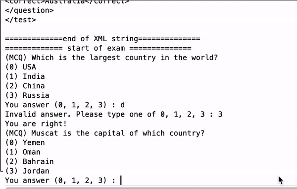

# Exam using Java

This is the program that allow you to save exam, read exam and run exam. A quick example below:

## Getting Started

Run the maven project with any IDE you like.

### Progrma Structure

* Main.java - main running program
* Question.java - Question class that includes following methods
    * toXML() - write XML string
    * getQuestion() - get question content
    * getAllAnswers() - get all possible choices as an arraylist
    * getCorrectAnswer() - get the unique correct answer
    * getQuestionType() - get the type of question: MCQ (multiple choice) | TF (true or false) | FB (fill the blank)
* Test.java - Test class the includes following methods
    * addQuestions() - add questions to list
    * toXML() - write XML string
    * getQuestions() - get all questions
    * saveXMLFile() - save XML string as a XML file
    * readXMLFile() - parse XML file into Test object
    * writeExam() - store Test object
    * doExam() - interactively do the exam on the terminal
* XMLizable.java - an interface that enforces implementation of toXML method
